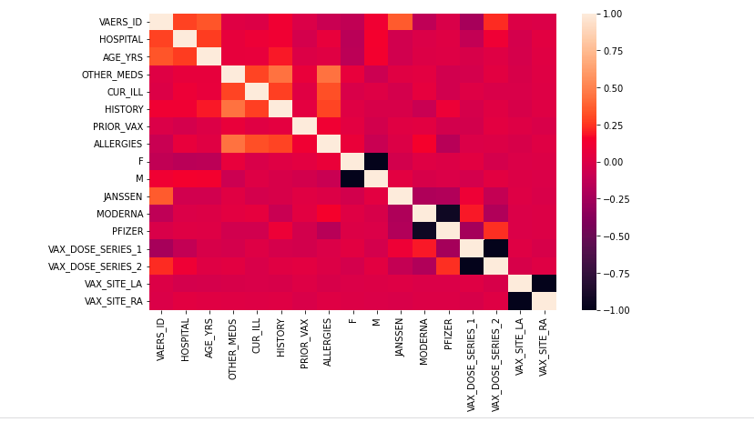

# &nbsp; &nbsp; &nbsp; &nbsp; &nbsp;  COVID-19 Vaccine Side Effect Predict

<!-- 
 -->

###  [Vaccine Side-Effects Predictor](https://vaccine-side-effect-predictor.herokuapp.com/)

 

<!-- TABLE OF CONTENTS -->

  
Table of Contents

    <li><a href="#1 Background ">Background</a></li>
    <li><a href="#2 Inspiration and Motivation ">Inspiration and Motivation</a></li>
    <li><a href="#3 Our Process ">Our Process</a></li>
      <ul>
         <li><a href="#Tools">Tools</a></li>
      </ul>
    <li><a href="#4 Data-Clean-UP">Data Clean Up </a></li>
    <li><a href="#5 Machine-Learning-Model">Machine Learning Model</a></li>
    <li><a href="#6 Conclusion”>Conclusion</li>
    <li><a href="#7 Sources">Sources</a></li>
    <li><a href="#8 The-Team">Team</a></li>
  </ol>

# **What Could You Expect After Your Covid Vaccine?**  
  
## **Background** 

The Vaccine Adverse Event Reporting System [VAERS](https://vaers.hhs.gov/reportevent.html) was created by the FDA and CDC to recieve and compile reports about 
the adverse events that may be associated vaccinations world wide, including the COVID-19 vaccines. Physicians and vaccine providers are encouraged to report adverse events after a vaccination. We used Kaggle [COVID-19 Vaccine Adverse Event Reporting System](https://www.kaggle.com/ayushggarg/covid19-vaccine-adverse-reactions?select=2021VAERSSYMPTOMS.csv) to gather vaccine records. 
  

(<a href="#top">back to top</a>)

## **Inspiration and Motivation**

Support individuals to understand what side effects they may experience from Covid Vaccination based on reported side effects from previous vaccine 
administrations.  Our site uses machine learning to decipher the input from user shared data that includes vaccine manufacturer, age, prior known allergies, 
medical history and gender.  The machine learning model predicts the possible side effects in the categories of "Mild", "Moderate", or "Severe" using the Logistic Regression model and the KNN model to determine possible side effects unique to each user. 

(<a href="#top">back to top</a>)

## **Our Process**
      
Perform ETL, create a web-based platform to gather user inputs and return side effects they may experiece. On output a user can further define medical 
terms and learn about specific medical terminology associated with their predicted side effects. 
      
    
### **Tools**
  

 

Tools, Languages, & Libraries Utilized

<li>Pandas</li></ul>
<li>Python</li></ul> 
<li>Pickle</li></ul>
<li>Plotly</li></ul>
<li>Matplotlib</li></ul>
<li>Jupyter Notebook</li></ul>
<li>VS Code</li></ul>
<li>D3 JS</li></ul>
<li>Seaborn JS</li></ul>
<li>Any Chart JS</li></ul>  
<li>HTML</li></ul>
<li>CSS</li></ul>
<li>Tableau JS</li></ul> 
<li>Flask</li></ul>   
<li>Themefisher</li></ul>
<li>Bootstrap</li></ul>
<li>Heroku</li></ul>

(<a href="#top">back to top</a>)

## **Data Clean UP** 
  
  * ETL 
      
    * Combined 3 datasets
      * [Vaccinations](https://www.kaggle.com/ayushggarg/covid19-vaccine-adverse-reactions?select=2021VAERSVAX.csv)
      * [VAERS Symptoms](https://www.kaggle.com/ayushggarg/covid19-vaccine-adverse-reactions?select=2021VAERSSYMPTOMS.csv)
      * [VAERS Data](https://www.kaggle.com/ayushggarg/covid19-vaccine-adverse-reactions?select=2021VAERSDATA.csv)
    * Remove Non-Covid Vaccine Data 
    * Research symptoms and assigned to categorical groupings 
    * Features are vaccine manufacturer, dose series number, age, gender, preexisting medical conditions, prior vaccination related complications
      
  * User Interface
      
      * Age - #
      * Gender - F/M 
      * Taking Other Medications - Y/N 
      * Pre-existing Conditions - Y/N
      * Allergies to Medications, Food or Other Products - Y/N
      * Previous Adverse reactions to Vaccines - Y/N 
      * Vaccine Type: Pfizer, Moderna, Janssen
      * Dose Series: First Dose or Second Dose

           

(<a href="#top">back to top</a>)

## **Machine Learning Model**
  
  * KNN to review and create list of associated side effect based on user input selections and output a word cloud of actual side effects
  * Logistic Regression Model, return rate of 90% accuracy
 
    
      
  
      
  
      
      
 ## **Website**
      
   * Heroku app to deploy
   * User interface 
   * Tableau to further review and possible side effect outcomes
   * Word cloud was linked to a dictionary for users to understand unfamiliar medical terms for personalized predicted side effects
   
 
      
 

(<a href="#top">back to top</a>)

## **Conclusion** 

Challenges

* As data scientists, we have limited medical expertise and many medical symptom terms had to be researched, resulting in the subjective assignment of category
  groups and the classification of severity of side effects. 
      
* Model selection, initially the KNN was returning an imbalance of “mild” categories based on the return of user input data which supports vaccine safety. We 
  kept the KNN model to provide side effects for the user interface and our outputs for the world cloud. It was further determined to use the Logistic 
  Regression model due to the large amount of datasets gathered to ensure the correct categorical outputs for either "Mild", "Moderate" or "Severe."
     
* Dataset for Covid side effects only from Dec 2020 to March 2021

Future Implications

* If we were given more time and resources our site is scalable. The data is readily available for all vaccinations so we could ptoentially expand to become a
  general vaccine information site to reassure patients about future risks to make informed decisions when considering upcoming vaccinations. 

* We would go directly to the source instead of Kaggle and extract data from the beginning of COVID vaccinations to now for more data.

* Recruit a medical professional to decipher mild, moderate, severe side effect classess and review quality of data.

* Further deep dive to examine the non-side effect patient data for trends that were reported to get an even better probability.
  
  

(<a href="#top">back to top</a>)

## **Sources**
 
[COVID-19 Vaccine Adverse Event Reporting System](https://www.kaggle.com/ayushggarg/covid19-vaccine-adverse-reactions?select=2021VAERSSYMPTOMS.csv) 
 

[VAERS](https://vaers.hhs.gov/)
  
[Merriam Webster](https://www.merriam-webster.com/)

(<a href="#top">back to top</a>)

  
##  **The Team**
[Amy Bednarz](https://github.com/abednarz210) ---|--- [Darrell Horich](https://github.com/D11eleven) ---|--- [Taylor Lyons](https://github.com/taylorsyde) ---|--- [Samantha Perez](https://github.com/Sjenn257)

  
 > The mind, in addition to medicine, has the power to turn the immune system around. -Jonas Salk  

#### **Medical Disclaimer**

###### This site is for informational or educational purposes only, and does not substitute professional medical advice or consultations with healthcare professionals.
  

(<a href="#top">back to top</a>)

